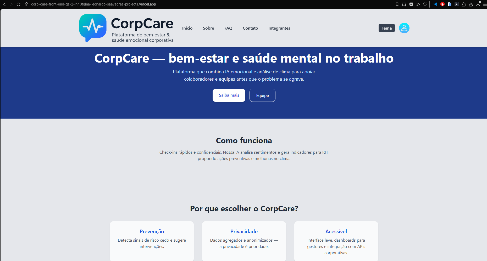
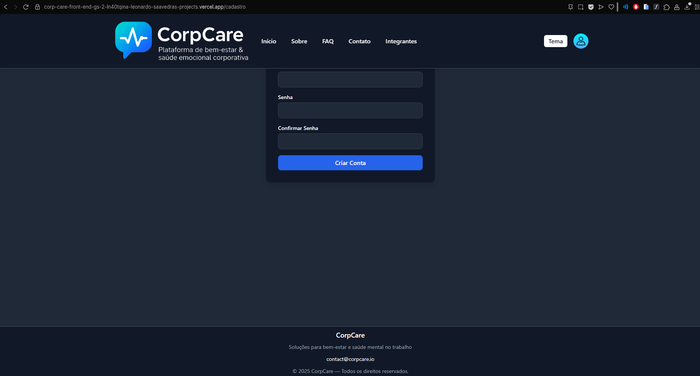
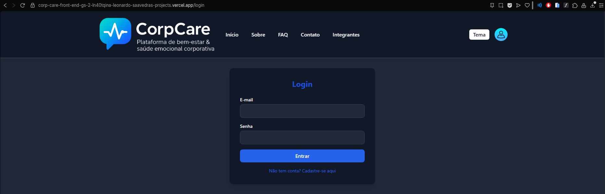
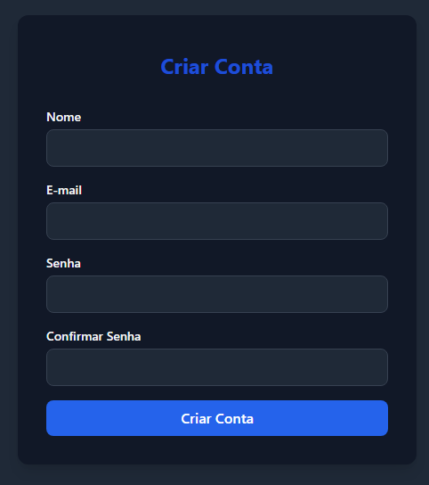

# Projeto CorpCare — Global Solution

## 1. Título e Descrição
Plataforma de bem‑estar corporativo (CorpCare) para promover saúde mental no trabalho, oferecendo cadastro, agendamento e recursos de apoio para colaboradores.

## 2. Status do Projeto
Em desenvolvimento - 95% pronto: 
FALTANDO: 
vídeo 3 minutos no youtube;
link da api de java;

## 3. Sumário
1. [Sobre o Projeto](#4-sobre-o-projeto)  
2. [Tecnologias Utilizadas](#5-tecnologias-utilizadas)  
3. [Instalação](#6-instalação)  
4. [Como Usar](#7-como-usar)  
5. [Estrutura de Pastas](#8-estrutura-de-pastas)  
6. [Endpoints ou Rotas Principais](#9-endpoints-ou-rotas-principais)  
7. [Autores e Créditos](#10-autores-e-créditos)  
8. [Screenshots / Demonstração](#11-screenshots--demonstração)
9. [Contato](#12-contato)  
10. [Links Úteis](#13-links-úteis)

## 4. Sobre o Projeto
CorpCare é uma aplicação front-end em React (Vite + TS) que consome uma API Java. Objetivo: centralizar funcionalidades de bem‑estar (cadastro de usuário, login, listagem, agendamento, suporte).

## 5. Tecnologias Utilizadas
- React + Vite + TypeScript  
- TailwindCSS  
- API Java — variável de ambiente `VITE_API_URL`  
- Node.js / npm

## 6. Instalação
1. Clone o repositório:
```bash
git clone https://github.com/Leonardo-Saavedra/CorpCare-Front-end_GS-2
```
2. Acesse a pasta do projeto:
```bash
cd CorpCare-Front-end_GS-2
```
3. Instale dependências:
```bash
npm install
```
4. `.env` com a variável:
```
VITE_API_URL= https://java-gs-gomk.onrender.com
```

## 7. Como Usar
1. Rodar em desenvolvimento:
```bash
npm run dev
```
2. Acesse localmente: http://localhost:5173  
3. URL pública da aplicação (Vercel): https://corp-care-front-end-gs-2-b77g4zcfw-leonardo-saavedras-projects.vercel.app

## 8. Estrutura de Pastas
```
/CorpCare-Front-end_GS-2
    /public
        vite.svg
    /src
        /assets
            Felipe.png
            Joao.png
            Leonardo.png
            login.png
            LOGO.png
            react.svg
        /components
            Footer.tsx
            Header.tsx
        /context
            TemaEscuro.tsx    
        /pages
            Cadastro.tsx
            Contato.tsx
            Faq.tsx
            Home.tsx
            Integrantes.tsx
            Login.tsx
            Sobre.tsx
        /services
            api.ts
    .env
    .gitignore
    eslint.config.js
    index.html
    package.lock.json
    package.json
    postcss.config.cjs
    README.md
    tailwind.config.cjs
    tsconfig.app.json
    tsconfig.json
    tsconfig.node.json
    vite.config.ts          
```

## 9. Endpoints ou Rotas Principais
(Base definida por `VITE_API_URL`)
- `POST /api/clientes` — Cadastro de cliente/usuário  
- `POST /api/login` — Autenticação  
- `GET /api/clientes` — Listagem de clientes


## 10. Autores e Créditos
| Nome                                    | RM      | Turma   | LinkedIn                                                                          | GitHub                                      |
|-----------------------------------------|---------|---------|-----------------------------------------------------------------------------------|---------------------------------------------|
| Felipe Ribeiro Salles de Camargo        | 565224  | 1TDSPY  | https://www.linkedin.com/in/felipe-ribeiro-2ba819303/                             | https://github.com/FelipeRibeiroSalles      |
| João Victor Santana dos Santos          | 566063  | 1TDSPY  | https://www.linkedin.com/in/jo%C3%A3o-victor-santana-2539a6365/                   | https://github.com/Jsantanadsx              |
| Leonardo Saavedra de Souza Campos       | 562229  | 1TDSA   | https://www.linkedin.com/in/leonardo-saavedra-de-souza-campos-a67179356           | https://github.com/Leonardo-Saavedra        |

## 11. Screenshots / Demonstração
Página inicial do site, no tema claro e escuro (podendo ser alterado no botão "tema") e com todos os links para outras páginas no header funcionando perfeitamente:



Footer e página de login/cadastro:




(todas as páginas adaptadas para o modo escuro e claro)

## 12. Contato
- Felipe Ribeiro Salles de Camargo: email academico: rm565224@fiap.com.br — e-mail pessoal: feliperscamargo@gmail.com
- João Victor Santana dos Santos: email academico: rm566063@fiap.com.br — e-mail pessoal: joao.santanadossantos07@gmail.com
- Leonardo Saavedra de Souza Campos: email academico: rm562229@fiap.com.br — e-mail pessoal: leonardosscampos@gmail.com

## 13. Links Úteis (para avaliação)
- Repositório GitHub: https://github.com/Leonardo-Saavedra/CorpCare-Front-end_GS-2
- URL Pública da aplicação no Vercel: https://corp-care-front-end-gs-2-b77g4zcfw-leonardo-saavedras-projects.vercel.app